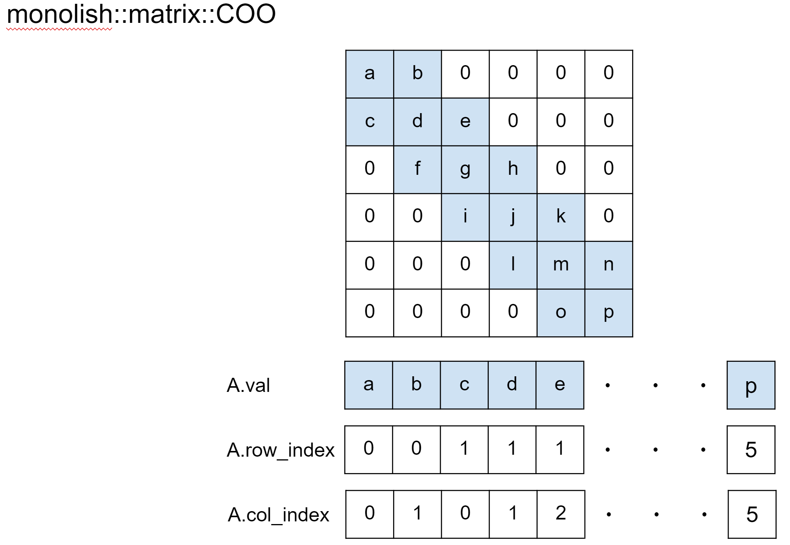
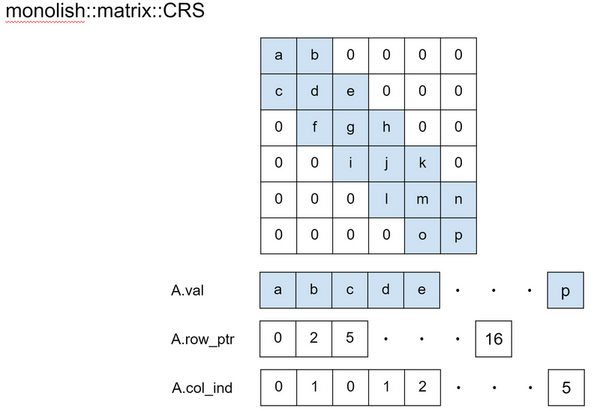
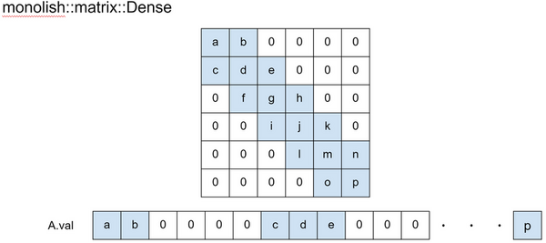

# monolish data types {#data_type}

## Introduction
In monolish, you can specify double or float as the template argument for each class.

## Vector
monolish::vector is a vector class like std::vector that can manage device memory of CPU and GPU.

Compared to std::vector, some functions commonly used in numerical computation are implemented.
- Random vector creation
- Match all elements
- Output of all elements to file or standard output

We plan to implement all the features of std::vector in the future.

## view1D
monolish::view1D is a vector reference class with offset.
It can be created from monolish::vector or monolish::matrix::Dense.

Since view1D is not a hardcopy but a reference, it can extract a part of a vector or matrix without cost.

We plan to implement a 2D view class in the future.

## Matrix
The implementation of the matrix storage format in monolish has several features.

The matrix format has the following two attributes:
1. `editable`
2. `computable`

A matrix storage format with the `editable` attribute can reference and add matrix elements.
A matrix storage format with the `computale` attribte can be used as an argument to a function for various operations.

In monolish, the Dense matrix is considered as one of the sparse matrix formats.
Currently, there are four matrix storage formats available: Dense, COO, CRS, and LinearOperator.
The attributes of each matrix storage format are shown below:
- monolish::matrix::Dense: `editable and computable`
- monolish::matrix::COO: `editable`
- monolish::matrix::CRS: `computable`
- monolish::matrix::LinearOperator: `computable` (special format)

Matrices stored in COO format can be easily referenced, but the computation cannot be parallelized. COO does not have any attributes to compute.

The computation of matrices stored in CRS format can be parallelized efficiently. CRS does not have the `editable` attribute.

Matrices stored in the Dense format can be edited and computed efficiently; Dense has both attributes.

The LinearOperator format is a special format that can be created from all matrix storage formats, but it does not have an `editable` attribute. 
LinearOperator does not have all utility functions and does not support GPU.

Matrix storage formats belong to one of three attribute groups: `editable` / `computable` / `editable and computable`.
when a new matrix storage format is implemented, all the matrices with the same attribute group will have the same functionality.
For example, We will implement ELL, JAD, and other storage formats, it will be implemented as a class with `computable` attributes like CRS.
(This is a beautiful implementation policy. But probably the policy will be broken....).

### Matrix Util functions list 

| func                          | COO (editable)              | Dense (editable/computable) | CRS (computable) |
|-------------------------------|-----------------------------|------------------------------|---------------|
| at                            | CPU                         | CPU                          | not impl.     |
| insert                        | CPU                         | CPU                          | not impl.     |
| row()/col()/diag()            | CPU                         | CPU/GPU                      | CPU/GPU       |
| type()                        | CPU                         | CPU                          | CPU           |
| get_data_size()               | CPU                         | CPU                          | CPU           |
| get_row()   / get_col()       | CPU                         | CPU                          | CPU           |
| print_all()                   | CPU                         | CPU                          | CPU           |
| print_all(std::string file)   | CPU                         | CPU                          | CPU           |
| send                          | don't support GPU           | CPU/GPU                      | CPU/GPU       |
| recv                          | don't support GPU           | CPU/GPU                      | CPU/GPU       |
| nonfree_recv                  | don't support GPU           | CPU/GPU                      | CPU/GPU       |
| device_free                   | don't support GPU           | CPU/GPU                      | CPU/GPU       |

## Storacture of matrix storage formats
### monolish::matrix::COO
monolish::matrix::COO uses following three arrays:
- `val` is an array of length # of nonzeros, which stores the values of the nonzero elements.
- `row_index` is an array of length # of nonzeros, which stores the row numbers of the nonzero elements.
- `col_index` is an array of length # of nonzeros, which stores the column numbers of the nonzero elements.

matrices stored in COO format do not guarantee that the data is sorted.
When working with COO matrices, it is assumed that the data is not sorted.

You need to call monolish::matrix::COO.sort() function before converting it to convert other storage format.

### monolish::matrix::CRS
monolish::matrix::CRS uses following three arrays:
- `val` is an array of length # of nonzeros, which stores the nonzero elements of matrix A along the row.
- `col_ind` is an array of length # of nonzeros, which stores the column numbers of the nonzero elements
stored in the array value.
- `row_ptr` is an array of length # of row + 1, which stores the starting points of the rows of the arrays value and index.

CRS records the data structure as a hash value, so that the structure can be checked quickly during computation.

In case of direct manipulation of an array with CRS format, it can be recalculated using monolish::matrix::CRS.compute_hash() function.

### monolish::matrix::Dense
monolish::matrix::Dense uses following one array:
- `val` is an array of length # of nonzeros (M*N).

### monolish::matrix::LinearOperator
monolish::matrix::LinearOperator is a common interface for performing matrix vector products.

This class serves as an abstract interface between iterative solvers and matrix-like objects.

See the [Scipy documentation](https://docs.scipy.org/doc/scipy/reference/generated/scipy.sparse.linalg.LinearOperator.html) for more details
