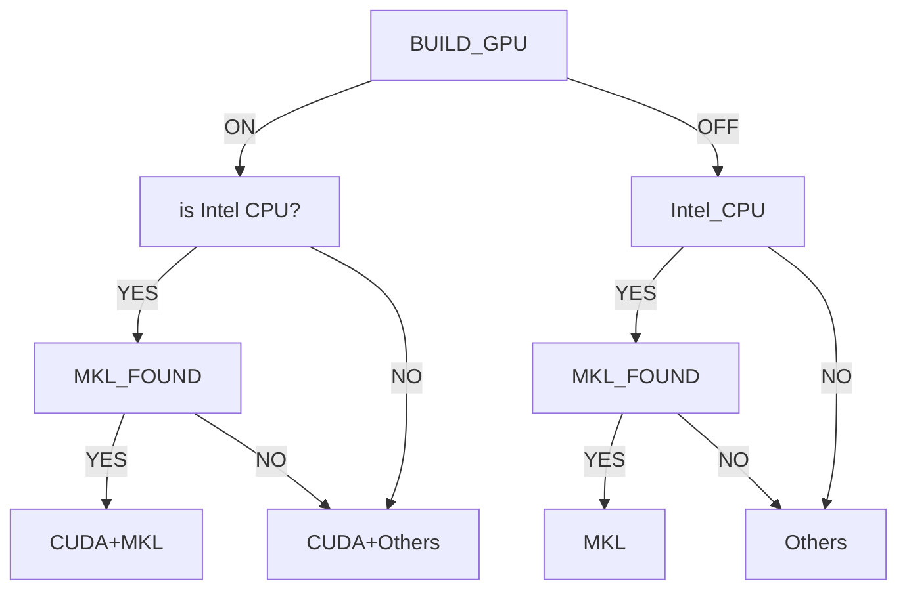

The figure is created with the following google slide:

https://docs.google.com/presentation/d/1A5bdb2lx38KiR0foaMEVYMYD2BbglJzq1sHdYBVaiTg/edit?usp=sharing

```mermaid
graph TD;
  BUILD_GPU -- ON --> Intel_CPU_CUDA[is Intel CPU?];
  Intel_CPU_CUDA -- YES --> MKL_FOUND_CUDA[MKL_FOUND];
  Intel_CPU_CUDA -- NO --> CUDA+Others;
  MKL_FOUND_CUDA -- YES --> CUDA+MKL;
  MKL_FOUND_CUDA -- NO --> CUDA+Others;
  BUILD_GPU -- OFF --> Intel_CPU;
  Intel_CPU -- YES --> MKL_FOUND;
  Intel_CPU -- NO --> Others;
  MKL_FOUND -- YES --> MKL;
  MKL_FOUND -- NO --> Others;
```
